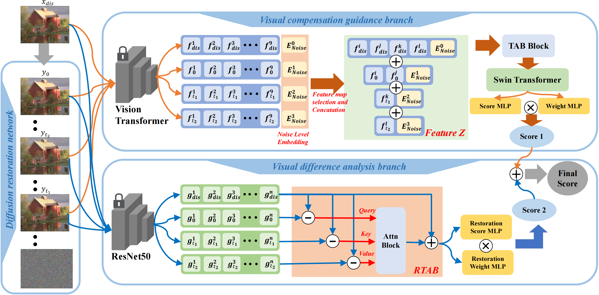

# DiffV2IQA
This is the official code for DiffV2IQA.

(Diffusion Model Based Visual Compensation
Guidance and Visual Difference Analysis for
No-Reference Image Quality Assessment, Zhaoyang Wang, Bo Hu, Mingyang Zhang, Jie Li, Leida Li, Maoguo Gong, Xinbo Gao)

The full code with training weights will be uploaded as soon as possible after our article is accepted.

## Network Architecture

---

> *Existing free-energy guided No-Reference Image
Quality Assessment (NR-IQA) methods continue to face challenges in effectively restoring complexly distorted images. The
features guiding the main network for quality assessment lack
interpretability, and efficiently leveraging high-level feature information remains a significant challenge. As a novel class of state-
of-the-art (SOTA) generative model, the diffusion model exhibits
the capability to model intricate relationships, enhancing image
restoration effectiveness. Moreover, the intermediate variables
in the denoising iteration process exhibit clearer and more interpretable meanings for high-level visual information guidance.
In view of these, we pioneer the exploration of the diffusion
model into the domain of NR-IQA. We design a novel diffusion
model for enhancing images with various types of distortions,
resulting in higher quality and more interpretable high-level visual information. Our experiments demonstrate that the diffusion
model establishes a clear mapping relationship between image
reconstruction and image quality scores, which the network
learns to guide quality assessment. Finally, to fully leverage high-
level visual information, we design two complementary visual
branches to collaboratively perform quality evaluation. Extensive
experiments are conducted on seven public NR-IQA datasets, and
the results demonstrate that the proposed model outperforms
SOTA methods for NR-IQA. * 
---

## Notes
This work is developed based on the work of SR3, MANIQA, VCRNet articles and many thanks to them for sharing their code!
