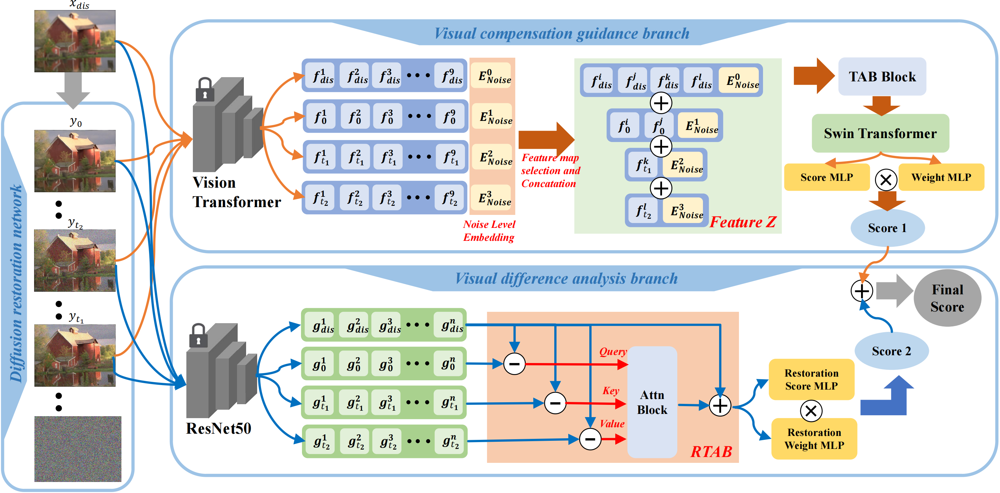

# DiffV2IQA

This repository contains the official implementation of **DiffV2IQA**:  
*Diffusion Model Based Visual Compensation Guidance and Visual Difference Analysis for No-Reference Image Quality Assessment*  
**Authors**: Zhaoyang Wang, Bo Hu, Mingyang Zhang, Jie Li, Leida Li, Maoguo Gong, Xinbo Gao

> The full codebase, including pretrained weights, will be uploaded after the article is accepted.

---

## Network Architecture


---

> *Existing free-energy guided No-Reference Image
Quality Assessment (NR-IQA) methods continue to face challenges in effectively restoring complexly distorted images. The
features guiding the main network for quality assessment lack
interpretability, and efficiently leveraging high-level feature information remains a significant challenge. As a novel class of state-
of-the-art (SOTA) generative model, the diffusion model exhibits
the capability to model intricate relationships, enhancing image
restoration effectiveness. Moreover, the intermediate variables
in the denoising iteration process exhibit clearer and more interpretable meanings for high-level visual information guidance.
In view of these, we pioneer the exploration of the diffusion
model into the domain of NR-IQA. We design a novel diffusion
model for enhancing images with various types of distortions,
resulting in higher quality and more interpretable high-level visual information. Our experiments demonstrate that the diffusion
model establishes a clear mapping relationship between image
reconstruction and image quality scores, which the network
learns to guide quality assessment. Finally, to fully leverage high-
level visual information, we design two complementary visual
branches to collaboratively perform quality evaluation. Extensive
experiments are conducted on seven public NR-IQA datasets, and
the results demonstrate that the proposed model outperforms
SOTA methods for NR-IQA. * 
---

## Key Contributions  
- **Novel Application of Diffusion Models in NR-IQA**: We introduce the first diffusion model for NR-IQA, leveraging high-level visual information for improved image restoration and quality assessment.  
- **Interpretability and Performance**: Our model improves image quality restoration by aligning closely with the self-repair mechanisms of the human eye, providing greater interpretability and clearer insights into image restoration processes.  
- **Dual-Branch Architecture**: We design two complementary branches to efficiently evaluate the quality of distorted images using high-level visual information, ensuring both restoration and quality assessment tasks are well-managed.

---

## Getting Started
### Prerequisites
All required dependencies are listed in the requirements.txt file. Install them using the following command:

```
pip install -r requirements.txt
```

### Steps to Run
Generate High-Level Visual Compensation Images:
Start by running the sr.py script located in the diffusion directory. This step generates high-level visual compensation images, which are essential for guiding the free-energy-based training network. Configuration parameters can be adjusted in the corresponding config file.

```
python diffusion/sr.py
```

Train the Network:
Next, run the main.py script to begin training. Ensure that all necessary file paths and parameters are correctly set in the configuration file before execution.

```
python main.py
```

By following these steps, you can successfully generate the required data and train the network.

## Future Updates
We will upload the corresponding pretrained weights for the diffusion model in future updates.

## Notes
This work is developed based on the work of SR3, MANIQA, VCRNet articles and many thanks to them for sharing their code!
